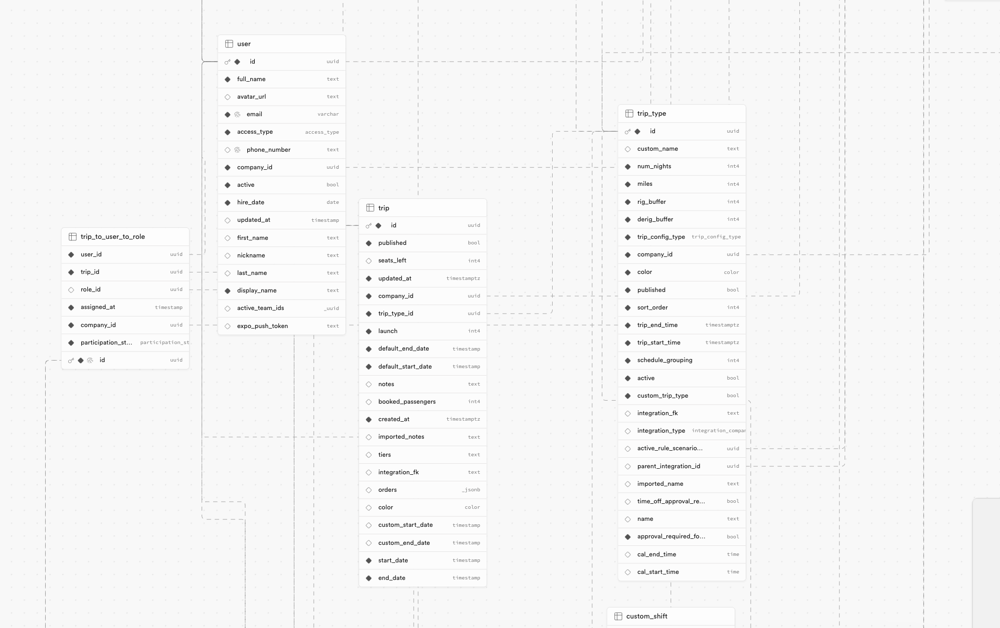

# Outfitter scheduling

My project models employee schedules for an outdoor adventure company. This is a production database that I have been working on for a few years. The screenshot I included had as much of the relevant schema as would fit in the schema gen service.



## Query I thought it did well on

**Question**: What is the name of the user that worked the most trips that started in July 2023?

**GPT SQL Response**:

```sql
SELECT u.full_name
FROM public.user u
JOIN public.trip_to_user_to_role tur ON u.id = tur.user_id
JOIN public.trip t ON tur.trip_id = t.id
WHERE t.start_date >= '2023-07-01' AND t.start_date < '2023-08-01'
GROUP BY u.id, u.full_name
ORDER BY COUNT(t.id) DESC
LIMIT 1;
```

**Friendly Response**: The user who worked the most trips starting in July 2023 is Kevin Mckinnon.

## Question that it tripped up on

This question would have required a back knowledge of area codes for phone number, so the zero shot completely failed. Could have used more context.

Question: What is the name of the user that is from North Carolina?

**GPT SQL Response**:

```sql
SELECT full_name FROM public.\"user\" WHERE company_id IN (
	    SELECT id FROM public.\"company\" WHERE billing_address ->> 'state' = 'North Carolina'
		);
```

SQL Result returned nothing

**Friendly response**: It looks like there are no users from North Carolina in the database.

The database made assumptions about how to find this information that was incorrect. In this case, the billing address of the company did not correspond to the home of the users

I was able to get a more accurate response on some of the other questions by adding more info in the schema. Postgres allows column comments, and describing in more detail what each column really meant in the schema allowed chatGPT to more accurately infer what was going on.

## Multi-shot

Multishot did not seem to significantly impact most of the queries. My guess is that further refinements to the seeded 'context' prompts would improve accuracy greatly.

**Question (multi-shot)**: What is the name of the user that has the most roles?

SQL Result: [
{
"full_name": "Erik Weiseth"
}
]

**Friendly response**: The user with the most roles is Erik Weiseth.

The multi-shot prompt changed nothing compared to zero shot

## Conclusion

Overall this seemed to process a really complex and large schema relatively well. I don't know if I would trust it as anything more than a starting point for designing sql queries. It was surprisingly difficult to feed the SQL from chatGPT as most postgres libraries have strong controls against doing this to prevent SQL injection. Any production system that used this would need robust controls over what was allowed for the database connection.
